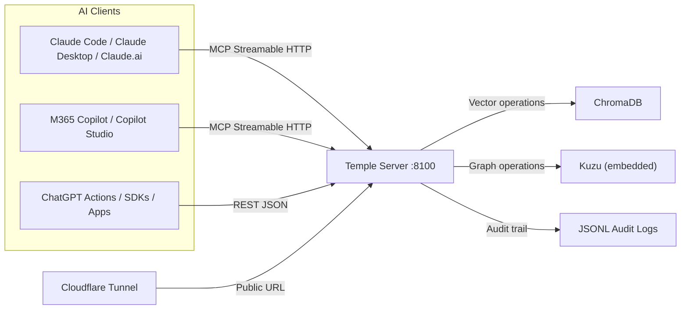
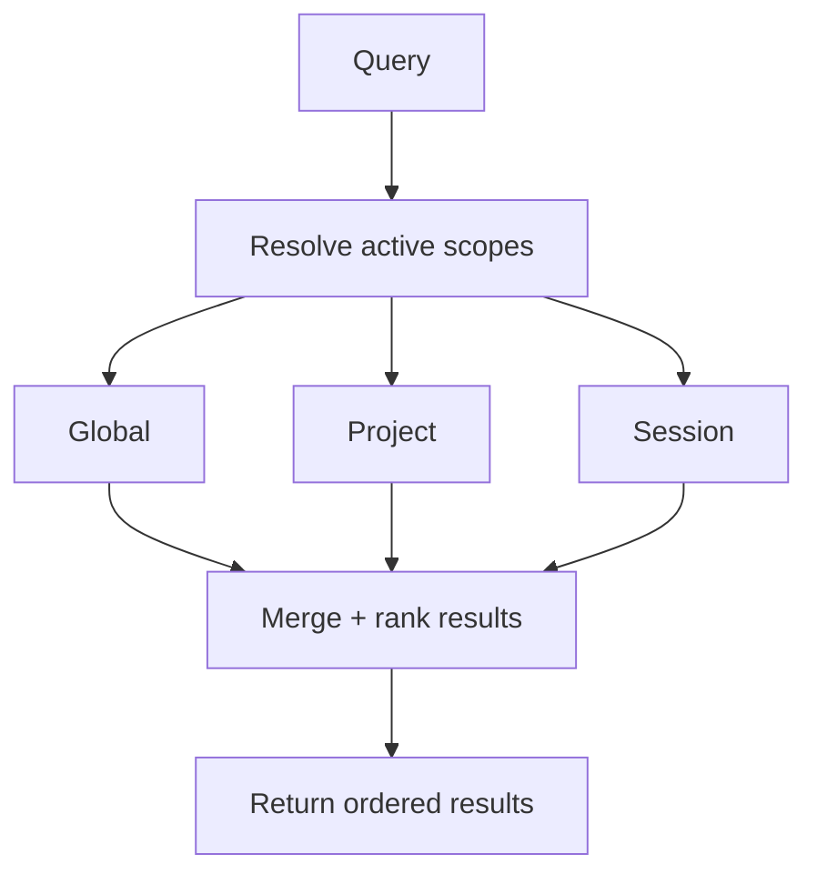

# Temple

Temple is a self-hosted memory platform for AI agents.

It exposes the same memory system through:

- `MCP` (`/mcp`) for Claude, Copilot Studio, and MCP-native clients.
- `REST` (`/api/v1`) for ChatGPT Actions, LangChain, LlamaIndex, Semantic Kernel, and custom apps.

Both surfaces run on the same process and data plane.

## Why Temple

- Persistent long-term memory across AI tools, not tied to one vendor.
- CPU-friendly local inference for embeddings (ONNX).
- Hybrid memory model: semantic vector retrieval plus graph relationships.
- Context hierarchy: `global`, `project:<name>`, `session:<id>`.
- Designed to run locally, then publish safely through a tunnel.

## Architecture





Ranking precedence is `session > project > global`.

## Current Surfaces

| Surface | URL | Notes |
|---|---|---|
| Health | `/health` | Always available for probes |
| MCP | `/mcp` | Streamable HTTP transport |
| REST API | `/api/v1/*` | Memory + graph + context + admin |
| OpenAPI | `/openapi.json` | REST schema for tools and SDKs |
| Swagger UI | `/docs` | Interactive REST docs |

## Authentication Model

Temple supports dual auth when `TEMPLE_API_KEY` is set:

- Static bearer token auth (`Authorization: Bearer <key>`).
- OAuth 2.1 (authorization code + PKCE), backed by FastMCP in-memory provider.

OAuth discovery endpoints:

- `/.well-known/oauth-authorization-server`
- `/.well-known/oauth-protected-resource/mcp` (RFC 9728 path-derived)
- `/.well-known/oauth-protected-resource` (compatibility fallback)
- `/mcp/.well-known/oauth-protected-resource` (compatibility alias)

If `TEMPLE_API_KEY` is empty, auth is disabled (local dev mode).

## Quick Start (Docker)

1. Copy config:

```bash
cp .env.example .env
```

2. Edit `.env` (at minimum set `TEMPLE_API_KEY` for non-dev use).

3. Start stack:

```bash
docker compose -f docker/docker-compose.yml up -d --build
```

4. Check health:

```bash
curl http://localhost:8100/health
```

5. Check OpenAPI:

```bash
curl http://localhost:8100/openapi.json
```

## Local Dev (uv)

```bash
uv sync --dev
cp .env.example .env
uv run python -m temple
```

Run tests:

```bash
uv run pytest tests/ -v
```

## Integration Examples

### Claude Code via API key

```bash
claude mcp add --transport http temple https://temple.tython.ca/mcp \
  --header "Authorization: Bearer <your-api-key>"
```

### Claude.ai Remote MCP

Use:

- URL: `https://temple.tython.ca/mcp`
- Client ID: `TEMPLE_OAUTH_CLIENT_ID`
- Client Secret: `TEMPLE_OAUTH_CLIENT_SECRET`

Note: while Anthropic OAuth client behavior is unstable in some paths, Temple now serves compatibility metadata endpoints in addition to RFC 9728 path-derived discovery.

### REST clients (ChatGPT / SDKs)

Use:

- Base URL: `https://temple.tython.ca/api/v1`
- OpenAPI: `https://temple.tython.ca/openapi.json`
- Auth header: `Authorization: Bearer <your-api-key>` (if enabled)

Sample REST write:

```bash
curl -X POST "https://temple.tython.ca/api/v1/memory/store" \
  -H "Authorization: Bearer <your-api-key>" \
  -H "content-type: application/json" \
  -d '{"content":"Temple deploy check"}'
```

## Runtime Modes

Set `TEMPLE_RUNTIME_MODE`:

- `combined` (default): serve MCP + REST on one port.
- `mcp`: MCP-only runtime.
- `rest`: REST-only runtime.

`TEMPLE_MCP_TRANSPORT` supports:

- `streamable-http` (default)
- `stdio` (only valid in `mcp` runtime mode)

## Data Layout

Persistent runtime data is in `data/`:

- `data/chromadb/` vector storage.
- `data/graph/kuzu/` graph storage.
- `data/audit/` append-only audit logs.

Backup script:

```bash
bash docker/scripts/backup.sh
```

## Key Environment Variables

| Variable | Purpose |
|---|---|
| `TEMPLE_RUNTIME_MODE` | `combined`, `mcp`, or `rest` |
| `TEMPLE_MCP_TRANSPORT` | `streamable-http` or `stdio` |
| `TEMPLE_API_KEY` | Enables auth when set |
| `TEMPLE_BASE_URL` | Public issuer/resource URL for OAuth metadata |
| `TEMPLE_OAUTH_CLIENT_ID` | Pre-registered OAuth client ID |
| `TEMPLE_OAUTH_CLIENT_SECRET` | Pre-registered OAuth client secret |
| `TEMPLE_OAUTH_REDIRECT_URIS` | Comma-separated redirect URI allowlist |
| `TEMPLE_SESSION_TTL` | Session scope expiry in seconds |

## Docs

- `docs/ARCHITECTURE.md`: full system design and deployment details.
- `docs/UPDATES_2026-02-11.md`: detailed last-24-hour change log and lessons learned.
- `docs/ROADMAP.md`: prioritized next steps.

## Status Snapshot

- Combined MCP + REST runtime is live.
- Public endpoint is live behind Cloudflare (`temple.tython.ca`).
- OAuth discovery compatibility routes are live for stricter and buggy clients.
- Test suite currently collects `66` tests.
