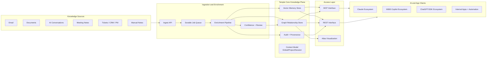

# Temple: Concept and Architecture (Target State + Current State)

Last updated: `2026-02-11`

## 1) Executive Concept
Temple is a **shared memory and relationship intelligence platform** for AI tools.

It is not a chatbot. It is the persistent system behind chatbots, copilots, and apps.

Temple's role is to:
- ingest knowledge from many sources (email, documents, chats, notes, tickets, meetings)
- structure that knowledge into memory + graph relationships
- expose the same trusted context to many AI ecosystems (`MCP` and `REST`)
- retain history over months and years

## 2) End Target State

### 2.1 Business Outcome
At end state, Temple acts as a durable **digital work brain**:
- one memory system across Claude, M365 Copilot, ChatGPT-style clients, and internal workflows
- one relationship model across people, projects, vendors, tools, risks, and decisions
- one governance path for confidence, review, provenance, and auditability

### 2.2 End-State Capabilities
- `Multi-source ingest`: email, docs, chat transcripts, meeting notes, CRM/ticket systems, manual text
- `Asynchronous enrichment`: background extraction of entities, relations, themes, commitments, and risk signals
- `Confidence policy`: auto-apply high-confidence links; queue medium-confidence links for review
- `Explainable retrieval`: every answer can reference source evidence and relationship provenance
- `Cross-agent interoperability`: same context available through MCP and REST simultaneously
- `Long-term durability`: no accidental context loss from short-lived session semantics
- `Operator control`: observability, replay, backup/restore, policy controls, and lifecycle management

### 2.3 End-State Experience
A Director or Senior Manager can ask any connected assistant:
- "What are my top unresolved commitments from email in the last 30 days?"
- "Which projects are at risk and which stakeholders are repeatedly involved?"
- "What changed this week in vendor relationships and blockers?"

And receive consistent answers because all tools query the same underlying memory graph.

## 3) End-State Architecture

### 3.1 Logical Components
- `Ingest API`: standard entrypoint for any text/event payload
- `Durable queue`: decouples ingestion from analysis throughput
- `Enrichment pipeline`: extraction, matching, scoring, deduping, relation inference
- `Review layer`: human-in-the-loop for ambiguous inference
- `Memory store`: semantic retrieval of unstructured knowledge
- `Graph store`: structured relationship model for traversal and reasoning
- `Audit/provenance`: immutable event history and source traceability
- `Access interfaces`: MCP + REST on shared core state

### 3.2 Data Contract (Target)
Every ingest item should carry:
- `item_type` (email, document, chat, meeting_note, ticket, note)
- `actor_id` (author/origin identity)
- `source` and optional `source_id`
- `timestamp`
- `content`
- `idempotency_key`
- optional `metadata`

This allows reliable replay, dedupe, governance, and cross-system joins.

### 3.3 Intelligence Policy (Target)
- High confidence: auto-create relation
- Medium confidence: queue review
- Low confidence: store signal only, no structural mutation

All graph writes should preserve:
- confidence score
- provenance pointers
- created/updated timestamps

## 4) End-State Use Cases

### 4.1 Inbox Intelligence
- process full inbox and threads
- identify commitments, owners, due dates, blockers
- maintain stakeholder relationship map over time

### 4.2 Project and Delivery Intelligence
- combine email + chat + PM signals
- detect recurring bottlenecks and dependency clusters
- improve weekly status and escalation readiness

### 4.3 Leadership Memory Continuity
- preserve decisions and rationale beyond any one chat session
- answer "why did we decide this?" with source references

### 4.4 Multi-Agent Consistency
- Claude/Copilot/ChatGPT-class clients all query same state
- reduce contradictory outputs between tools

## 5) Non-Functional End-State Requirements
- `Durability`: persistent across restarts, upgrades, and host migration
- `Security`: auth on external interfaces, scoped access controls, key rotation patterns
- `Observability`: queue depth, processing latency, extraction success rate, review load
- `Recoverability`: backup/restore drills and replayable ingest
- `Scalability`: handle batch imports (for example full inbox history)
- `Governance`: auditability, explainability, and safe approval workflows

## 6) Current State (As Of 2026-02-11)

### 6.1 What Is Working Now
- Combined runtime is live: MCP + REST on one service
- Public endpoint pattern is established (`temple.tython.ca`)
- Graph + vector + context foundation is operational
- Atlas graph UI is available and usable
- Background enrichment pipeline exists
- Confidence gating + review queue exists
- Job/review persistence across restart is implemented
- OAuth discovery compatibility routes are in place for MCP client variability

### 6.2 Current Scope of Enrichment
- Current enrichment flow is functionally useful but still tuned to a narrow "survey-like" ingest naming and heuristics
- It already performs async analysis and relation creation/review, but naming and contracts are not yet generalized for enterprise ingest semantics

### 6.3 Current Strengths
- Strong base architecture for interoperability
- Working long-lived knowledge substrate
- Practical production learnings already incorporated (auth compatibility, restart durability)

### 6.4 Current Gaps Versus End State
- `Naming and API semantics`: ingest is still framed as "survey" in public API names
- `Ingest breadth`: no first-class connectors yet for email/doc/chat pipelines
- `Extraction quality`: heuristic extraction needs higher-fidelity NLP/LLM-assisted stages
- `Queue model`: durable state exists, but still file-based and should evolve to stronger structured persistence
- `Policy controls`: confidence thresholds and write policies need formal configuration by source/type
- `Operations`: more metrics, alerts, and replay tooling required for enterprise confidence

## 7) Transition Plan To End State

### Phase A: Reframe and Generalize Interface
- Rename public ingest contract from "survey" to general "ingest item"
- Keep backward-compatible aliases for existing routes
- Standardize metadata contract for all source types

### Phase B: Source Connectors
- email ingest (initially batch import + incremental sync)
- document ingest (files/folders)
- conversation ingest (AI transcripts)

### Phase C: Intelligence Quality
- stronger entity linking and canonicalization
- relation-type taxonomy hardening
- explainability improvements for each inferred edge

### Phase D: Operational Maturity
- durable queue backend and replay controls
- dashboard for queue/review throughput and errors
- backup/restore and recovery rehearsal automation

## 8) Strategic Positioning
Temple's differentiated value is not "another assistant." It is:
- a reusable organizational memory layer
- interoperable across AI vendors and tools
- designed for compounding context quality over time

That is the end target this architecture is intended to reach.
