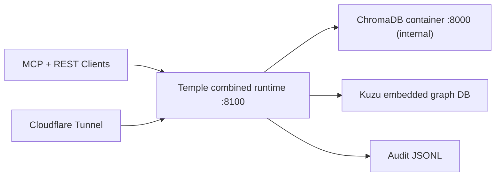

# Temple 24-Hour Update

Date: `2026-02-11`

This document captures what changed in the last 24 hours, why it changed, current architecture status, lessons learned, and immediate roadmap implications.

## Executive Summary

In the last 24 hours Temple moved from an MCP-first server to a production-ready unified memory platform:

- MCP and REST now run together on one process/port.
- Auth now supports static API key and OAuth 2.1 in the same runtime.
- OAuth metadata discovery now includes compatibility routes for imperfect clients.
- Memory, graph, and context layers were hardened with schema/version handling and session lifecycle cleanup.
- Deployment to `main` and the running Docker stack was completed and verified.

## Commit Timeline (Last 24 Hours)

1. `51792fe` (`2026-02-11 10:07:50 +0000`)  
   `Add combined MCP+REST runtime and harden memory platform`

2. `1b47288` (`2026-02-11 10:26:17 +0000`)  
   `Add OAuth discovery compatibility routes for MCP clients`

## What Changed

## 1) Runtime and API Surface Expansion

Primary outcome: one backend now serves both MCP and REST with shared broker/state.

Files:

- `src/temple/__main__.py`
- `src/temple/combined_server.py`
- `src/temple/rest_server.py`
- `src/temple/config.py`

Notable behavior:

- `TEMPLE_RUNTIME_MODE=combined` is now the default.
- MCP mounts at `/mcp`.
- REST mounts at `/api/v1`.
- `openapi.json` and `/docs` are available on the same service.

## 2) Authentication and OAuth Hardening

Primary outcome: Temple can support both token-based and OAuth-based clients concurrently.

Files:

- `src/temple/auth.py`
- `src/temple/server.py`
- `.env.example`
- `tests/test_server_auth.py`

Notable behavior:

- If `TEMPLE_API_KEY` is set, MCP + REST require bearer auth.
- OAuth provider supports pre-registered client mode (locked).
- OAuth provider supports dynamic registration mode (open fallback).
- If client ID/secret are set but redirect URIs are missing, Temple logs and falls back to dynamic registration.

## 3) OAuth Discovery Compatibility for Real Clients

Primary outcome: better interoperability with clients that do not fully follow path-derived OAuth protected resource discovery.

Files:

- `src/temple/server.py`
- `tests/test_combined_server.py`
- `docs/ARCHITECTURE.md`

Added endpoints:

- `/.well-known/oauth-protected-resource`
- `/mcp/.well-known/oauth-protected-resource`
- existing RFC endpoint remains: `/.well-known/oauth-protected-resource/mcp`

Behavior:

- Metadata points to the same MCP protected resource (`/mcp`).
- `resource` query parameter is validated.
- Mismatched resources return `404`.
- Auth-disabled mode does not advertise protected-resource metadata.
- Responses include `Cache-Control: no-store`.

## 4) Memory + Graph Robustness Improvements

Primary outcome: safer operations at higher scale and better lifecycle controls.

Files:

- `src/temple/memory/broker.py`
- `src/temple/memory/graph_store.py`
- `src/temple/memory/context.py`
- `src/temple/memory/vector_store.py`
- `src/temple/tools/admin_tools.py`

Notable behavior:

- Session TTL cleanup now deletes expired session collections and graph scope data.
- Tag-only memory search now paginates (`get_all`) instead of single-shot reads.
- Graph store now detects legacy vs v2 schema.
- Migration path exists for legacy graph schema (`migrate_legacy_schema` with backup snapshot).
- Scope parsing is stricter (`global`, `project:<name>`, `session:<id>`).
- Retrieval merges results across active scopes and sorts by scope precedence then relevance.

## 5) Testing and Operational Validation

Files:

- `tests/test_combined_server.py`
- `tests/test_rest_server.py`
- `tests/test_graph_store.py`
- `tests/test_broker.py`
- `tests/test_vector_store.py`

Status:

- Suite currently collects `66` tests.
- New tests cover combined runtime behavior and OAuth discovery compatibility paths.
- Deployment verified healthy with container checks and endpoint probes.

## 6) Visualization Layer Added

Primary outcome: Temple now has built-in graph export + interactive browser explorer.

Files:

- `src/temple/rest_server.py`
- `src/temple/memory/broker.py`
- `docs/VISUALS.md`

New surfaces:

- `GET /api/v1/admin/graph/export` for visualization payloads.
- `GET /atlas` interactive graph explorer (search, filtering, drill-down, cross-links).

Notable behavior:

- Export includes `source_scope` and `target_scope` relation fields for better node identity resolution.
- Export endpoint is auth-protected when `TEMPLE_API_KEY` is set.

## Architecture Snapshot (Post-Update)

## Features Available Now

MCP tools (`26` total):

- Memory: `store_memory`, `retrieve_memory`, `recall_memory`, `search_memories`, `delete_memory`
- Entities: `create_entities`, `update_entity`, `delete_entities`, `get_entity`, `search_entities`
- Relations: `create_relations`, `delete_relations`, `get_relations`, `find_path`
- Observations: `add_observations`, `remove_observations`
- Context: `set_context`, `get_context`, `list_projects`, `list_sessions`
- Admin: `get_stats`, `reindex`, `export_knowledge_graph`, `compact_audit_log`, `get_graph_schema_status`, `migrate_graph_schema`

REST compatibility endpoints:

- Memory CRUD/search
- Entity/relation/observation operations
- Context endpoints
- Admin stats + graph schema/migration
- OpenAPI + Swagger docs

## Lessons Learned

1. Single-runtime architecture reduces integration overhead.
The combined MCP + REST mode simplifies deployment and keeps behavior consistent across agent ecosystems.

2. OAuth client behavior varies more than specs imply.
Even with standards-compliant metadata, compatibility aliases materially improve real client connectivity.

3. Keep health endpoints independent from auth.
Operational stability depends on unauthenticated health checks for Docker/system probes.

4. Schema migration must be first-class in graph-backed memory systems.
Legacy graph schemas are common in iterative projects. Built-in migration and backup paths reduce risk.

5. Context tiering is only useful when enforced everywhere.
Retrieval ordering, write scope resolution, and cleanup policy must all agree on scope semantics.

## Risks and Open Decisions

Current known risk:

- OAuth is currently in open dynamic registration fallback if redirect URI allowlist is not configured.

Current accepted posture:

- This is accepted short-term to preserve compatibility while Anthropic MCP OAuth behavior stabilizes.

Decision to revisit:

- Move to strict pre-registered OAuth client mode when redirect URI behavior across required clients is stable.

## Roadmap Impact (Near-Term)

The past-24h work shifts the immediate roadmap from "feature build-out" to "production policy hardening":

1. Finalize OAuth lock-down plan and redirect URI allowlist strategy.
2. Migrate legacy graph schema to v2 in production.
3. Add integration smoke tests for Claude/Copilot/REST clients.
4. Add stronger observability and runbook docs around auth/session cleanup behavior.
