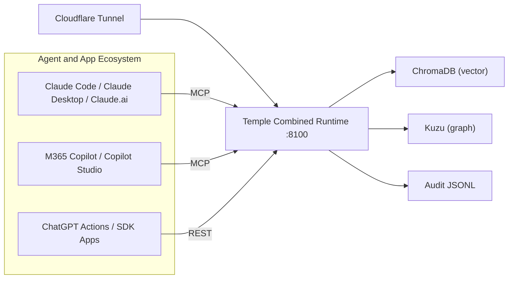
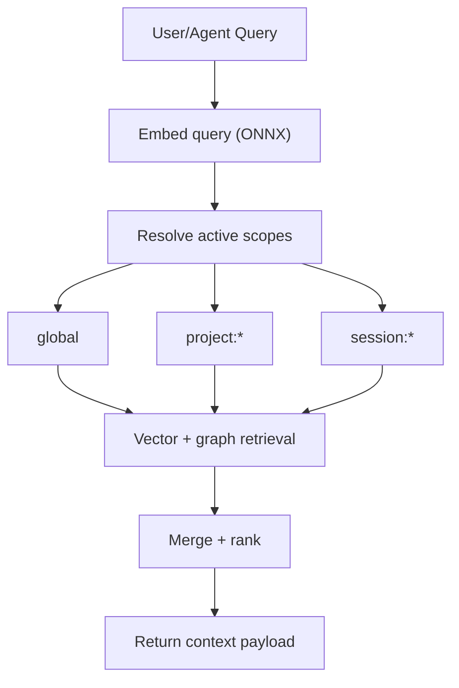
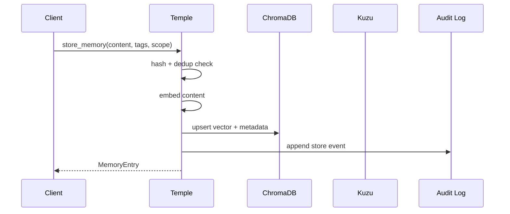
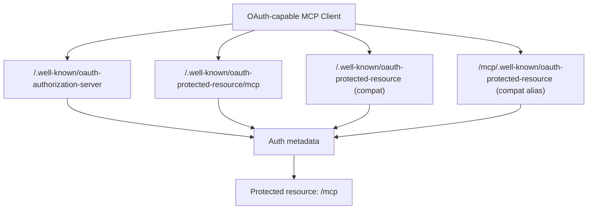
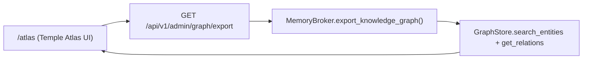

# Temple Visuals

This file centralizes diagram views of Temple's architecture, auth model, and data flow.

## 1) Platform Topology

## 2) Retrieval Path

Ranking priority: `session > project > global`, then relevance score.

## 3) Memory Write Path

## 4) OAuth Discovery Map

## 5) Graph Explorer Surface

Use `/atlas` for interactive drill-down, scope filtering, and cross-linked relation inspection.
